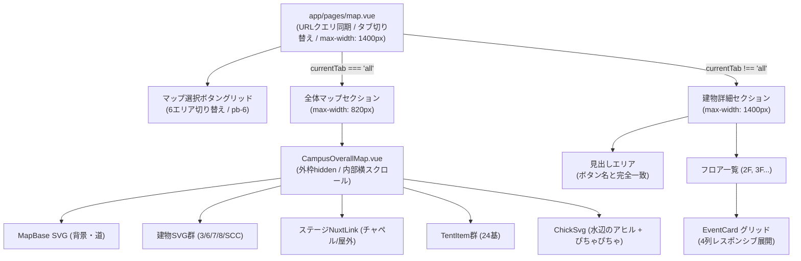

# 場内マップ・施設案内 リファクタリング概要 (map.md)

このドキュメントは、`app/pages/map.vue` および関連するマップ表示コンポーネント群における機能改修、UX改善、UI設計、および将来のリファクタリングに向けた設計指針をまとめたものです。

---

## 1. 概要 & 関連ファイル

- **メインページ:** [`app/pages/map.vue`](file:///c:/Users/tkytw/Desktop/github/Home-Page/app/pages/map.vue)
- **主要コンポーネント:**
  - 全体マップレイヤー: [`app/components/map/CampusOverallMap.vue`](file:///c:/Users/tkytw/Desktop/github/Home-Page/app/components/map/CampusOverallMap.vue)
  - 模擬店テント: [`app/components/svg/map/tent.vue`](file:///c:/Users/tkytw/Desktop/github/Home-Page/app/components/svg/map/tent.vue)
  - 建物SVG: `no3.vue`, `no6.vue`, `no7.vue`, `no8.vue`, `scc.vue`
  - 背景マップSVG: `map-base.vue`
  - アヒル（遊び心要素）: [`app/components/svg/map/chick.vue`](file:///c:/Users/tkytw/Desktop/github/Home-Page/app/components/svg/map/chick.vue)
- **データ管理:**
  - 建物・フロア企画データ: [`app/data/map-buildings.ts`](file:///c:/Users/tkytw/Desktop/github/Home-Page/app/data/map-buildings.ts)
  - キャンパス施設データ: [`app/data/maps.ts`](file:///c:/Users/tkytw/Desktop/github/Home-Page/app/data/maps.ts)

---

## 2. 実装仕様とユーザー要件の経緯

### ① ページルーティングとURL履歴同期
- `/map/index.vue` から `app/pages/map.vue` へ移行。
- タブ切り替え（`all`, `no3`, `no6`, `no7`, `no8`, `scc`）時に `router.push({ path: '/map', query: { tab: key } })` を実行し、ブラウザ履歴に積む設計。
- ブラウザの「戻る」「進む」操作やスマホのスワイプ戻り時に、`watch(() => route.query.tab)` で自動的にアクティブタブを正しく復元。
- クエリがない場合はデフォルトの「全体マップ (`all`)」へ復帰。

### ② マップ選択ボタンとページタイトルの完全一致
- 上部のマップ選択ボタングリッドの表記と、各ページのタイトル（`<h2>`）の不一致を解消：
  - **全体マップ:** ボタン `全体マップ` → 見出し **`全体マップ`**（サブ: キャンパス ＆ 模擬店エリア）
  - **3号館:** ボタン `社会連携館` (3号館) → 見出し **`社会連携館 (3号館)`**
  - **SCC:** ボタン `屋内ステージ` (SCC 4F) → 見出し **`屋内ステージ (SCC 4F)`**
  - **7号館:** ボタン `音楽館` (7号館) → 見出し **`音楽館 (7号館)`**
  - **8号館:** ボタン `文化館 (8号館)` (8号館) → 見出し **`文化館 (8号館)`**
  - **6号館:** ボタン `文化館 (6号館)` (6号館) → 見出し **`文化館 (6号館)`**

### ③ ヘッダーデザインの統一と不要UIの削除
- 建物詳細タブ上部にあった四角い枠付きカード（`.building-header-card`）を撤廃し、全体マップ側と同様に枠なしの `.section-heading-box`（`<h2>` + `
`）に統一。
- 「← 全体マップに戻る」ボタンは、上部タブ切り替えおよびブラウザの戻る操作で代替できるため削除。
- 階層（フロア）見出し（2F, 3F等）の下にあったサブの薄い補足テキスト（`fl.description`）を削除し、すっきりとした階層一覧に整理。

### ④ 最大幅（`max-width`）のレスポンシブ設計
- **ページ全体・タブ・建物詳細フロア企画一覧:**
  - PC大画面で広々と表示できるよう **`max-width: 1400px`** を採用。フロア内の企画カードグリッド（`.events-grid-responsive`）が多列で綺麗に展開。
- **キャンパス全体マップ（`.map-content-section`, `.overall-map-container`）:**
  - 縦長のアスペクト比（457.29 : 652.38）であるため、1400pxまで広げると縦スクロールが長くなりすぎる問題を防止。
  - 全体マップのコンテンツ枠のみ最初の最大幅 **`max-width: 820px`** を維持。

### ⑤ `pb`（padding-bottom）による下方向余白設計
- `pt-10` による不自然な押し下げを撤廃し、上流要素から下方向へ余白を刻む設計に変更：
  - マップ選択ナビゲーション: `pb-6 sm:pb-8`
  - 見出しエリア（`.section-heading-box`）: `pb-4 sm:pb-6`
  - ページ最下部コンテナ: `pb-20`（フッターとの間の十分な余白）

### ⑥ キャンパス全体マップのレイヤー構造とスマホ操作性
- **レイヤー重ね合わせ構成:**
  1. 背景レイヤー: `MapBase`（道、樹木、池、その他の建物）
  2. 建物レイヤー: `No3Svg`, `No6Svg`, `No7Svg`, `No8Svg`, `SccSvg`、チャペル・屋外ステージリンクピン、アヒル
  3. テントレイヤー: 24基の `TentItem`（パーセント座標管理）
- **外枠マスク & 内部スクロール:**
  - `.map-outer-frame` に `overflow: hidden` を指定し、スマホ等で枠外へのはみ出しを防止。
  - `.map-scroll-viewport` で左右スクロール可能にしつつ、`.map-canvas` に `min-width: 700px` を持たせることで、画面幅が狭くなっても地図本体が豆粒のように縮小せず、鮮明に閲覧・タップ可能。
  - 初期マウント時（`onMounted`）にメインストリート付近（約42%位置）へ自動スクロール。

### ⑦ 模擬店テント（`tent.vue`）の仕様
- テント番号（通常:「1」「2」…、企業テント:「企業1」「企業2」…）を描画。
- マウスホバーまたはタップで `EventCard` をツールチップ表示。
- カードの周りに不要な余白や枠線ボックスをつけず、`EventCard` 自体を直接フロート表示。
- スマホで2回タップしないと開かない問題を解消（タップ判定・タッチターゲット拡大）。

### ⑧ イースターエッグ：水辺のアヒル（`chick.vue`）
- 6号館の左側水エリア（池）の原本SVG座標（`left: 59.23%`, `top: 15.75%`）に配置。
- 通常時は水面に浮かんでゆったりプカプカ揺れる（`duckFloat`）。
- ホバー時（PC）およびタップ時（スマホ）に小刻みに跳ねて左右に体を振る「ぴちゃぴちゃ」アクション（`pichaPicha`）。
- 2重の水色リング波紋（`pichaRipple`）と水滴飛び散り（`splash`）CSSアニメーション。
- タップ / クリック時に「ぴちゃぴちゃ！」「ピヨッ♪」「クワッ！」「すいすい〜」「🐣✨」の吹き出しをポップアップ表示。

### ⑨ 施設略称の正確な定義
- **SCC:** 正式名称は `Science and Culture Center`（「学生センター」や「Student Community Center」ではない）。`map-buildings.ts` および `maps.ts` で定義を修正。

---

## 3. コンポーネント構成図

---

## 4. 今後の推奨リファクタリング方針

1. **タブ情報と建物データの統合・一元管理:**
   - 現在 `map.vue` 内の `tabs` 配列と `map-buildings.ts` の `getBuildingDataList()` でそれぞれ定義されているため、`map-buildings.ts` 側にタブ情報（label, sub, title, order）を統合し、`map.vue` はそれをインポートするだけにする。
2. **テント配置データ（`tentList`）の外部ファイル化:**
   - `CampusOverallMap.vue` 内にハードコードされている24基のパーセント座標（left, top, width, height, placement）を `app/data/map-tents.ts` 等へ切り出すことで、保守性とコンポーネントの見通しを向上させる。
3. **アヒル機能の独立コンポーネント化:**
   - `CampusOverallMap.vue` 内に記述されているアヒルのアニメーションスタイル（約150行）とリアクション状態を `components/map/MapEasterEggDuck.vue` 等としてコンポーネント分離する。
4. **型安全性の向上:**
   - `buildingId` のリテラル型（`'no3' | 'no6' | 'no7' | 'no8' | 'scc'`）を `types/map.ts` にエクスポートし、他画面（イベント詳細からの遷移等）と共通で利用する。
